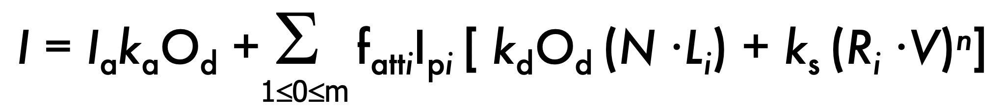
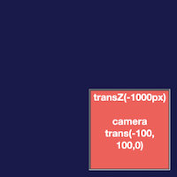
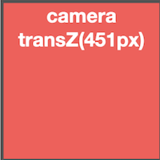
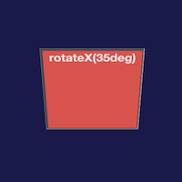
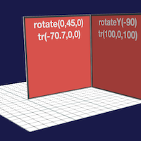
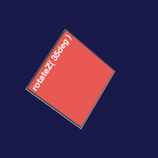
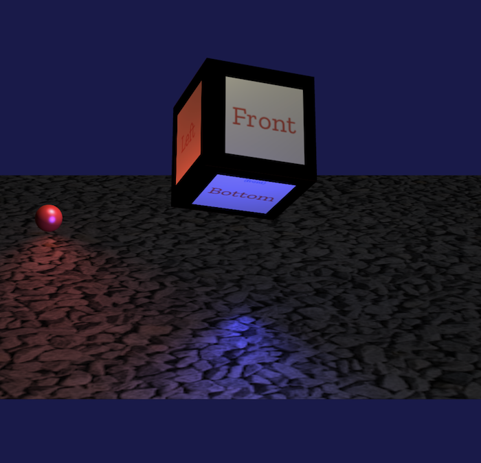

# Assignment 2: Scene Graph in WebGL

In this assignment, you will take the simple scene graph created in A1 and redo it for WebGL.  The scene graph supports various simple 3D objects, textures and lights.  You will write a shader to implement a lighting model similar to the one discussed in class.

## Due: Friday Oct 4th, 11:59pm

## Author

**Name:  PLEASE PUT YOUR NAME HERE**

## Overview 

The assignment requires you to do two main things:

1. Implement a WebGL renderer for the scene graph library defined in `src/SG.ts`. A number of new classes have been provided to define the interface that you must implement.
2. Adjust the texture coordinates on the box model generated by the included code, to properly map a custom texture labelling the faces. 

The learning objectives of this assignment are to gain hands on experience with shaders, 2D texturing and the Phong illumination model.  The amount of code provide exceeds the amount of code you must write, so please start by taking the time to understand the updated `src/SG.ts`

The assignment will be graded out of 30.  

You should submit your project using github classroom, as in the previous assignments.  All of the code for the scene graph should be in `src/SG.ts`, and the texture coordinates on the box should be adjusted in the provided sample code (`src/app.ts` and `src/ex2.ts`) such that the central cube in the sample is textured as shown below. 

As before, the TAs should be able to compile your files by running the ```tsc``` command and then open index.html to see your animated character.

## The Scene Graph

The graph's ```render()``` method will compute all of the transformations on the tree of "Things" (graph nodes). The method will compute the camera matrices as before, and the world transformation matrix for each Drawable element in the graph. It will now need to also find the position of each light in the graph and, unlike the previous version of SG.ts, you will **NOT** use any HTML or CSS in the graph, but render everything with WebGL.  

An updated skeleton of src/SG.ts is provided.

The main task will be to complete a shader that implements a lighting model similar to the one discussed in class.  The equation for the Phong lighting model you will implement is:

(where `Ipi` is the illumination of light `i`, a combination of the color of the light and a floating point intensity that scales the color).

The sample code also includes a new version of the previous example program (`ex1.html` and `src/ex1.ts`) that uses src/SG.ts to render the set of five simple scenes from A1 (the cubes have images of the DIVs from A1 texture mapped onto them):

- single cube, translated -11000 in z, camera translated by (-100,100,0)<br>


- single cube, translated -100 in z, camera translated by 451, so the front of the cube fills the view<br>


- single cube, flatted with a non-uniform scale, rotated by 35 degrees around X<br>


- two flattened cubes, transformed to be 90 degrees from each other, rotated on an edge, with a camera rotation, and a simple ground plane under them<br>


- single flattened cube, rotating, with camera rotating as well<br>


## Details

We have provided two different test programs that can be used test your src/SG.ts module.  First, src/ex1.ts and ex1.html implement scenes similar to A2.  You can use this as a first set of tests;  once ex1.html matches the images above, your src/SG.ts probably mostly works.  The images above are from this working sample.

A second test is in index.html plus src/app.ts, and ex2.html plus src/ex2.ts.  These two programs implement similar scenes, but index.html is animated (and the central cube is tilted forward, showing the top), while ex2.html is static (and the central cube is tilted upward, showing the bottom).  

- Here is the animated index.html:


- Here is the static ex2.html:


A version of ex2.ts without textures is in ex3.ts;  this will be useful for testing if you have not yet gotten textures working.  Ex4 and ex5 are a scene (animated and not) with eight lights. 

The second part of the assignment is to adjust the texture coordinates on this central cube (in both src/app.ts and src/ex2) so that the texture on it has each of the six "names" mapped to the correct fact, and orientated correctly (as shown in the above images):
- "front", "back", "left", "right" should be on the appropriate sides (left and right are on the left and right sides when looking at the front).  The text should be oriented so it is in the natural, readable orientation (the text should be horizontal and read left-to-right).  
- "top" and "bottom" have smaller "(front)" text near one edge: that is the edge that should touch the front face.


### Scene Graph

The sample code has comments to explain what needs to be written, but the main requirements are:

- Use WebGL instead of the CSS Perspective Div.  The Scene constructor has been updated to set up the canvas correctly.
- The scene graph now has "Drawable" (to replace HTMLThing) that has a "mesh" in it that should be rendered using a WebGL shader.  There are a number of subtypes of Drawable provided to implement some standard object types.
- Each Drawable has a Surface properties property that defines the parameters to the lighting equation, and may also include a Texture for the surface.  
- There are now lights, which can be positional or directional.  Your graph should support up to either lights.  
- The shader program for your project should support having a texture or not, having directional and point lights, and having up to eight lights.

### Custom Texture Coordinates

The test files in src/app.ts and src/ex2.ts both contain a place to update the texture coordinates on the central cube in the scene.  The initial texture coordinates (which correspond to the default coordinates on the cube) map the entire texture to each face of the cube.  You should change the coordinates so that the correct 1/9th of the texture maps to the correct face, with the correct orientation, as described above.

## Submission

You will check out the project from github classroom, and submit it there.  The project folder should contain the files that were in the sample project, plus any additions to the sample project that are needed to implement the project.  Do not add extra files, and do not remove the .gitignore file (we do not want the "node_modules" directory in your repository.)

**Do Not Change the names** of the existing files (e.g., ex1.html, src/SG.ts, etc).  The TAs need to be able to test your program as follows:

1. cd into the directory and run ```npm install```
2. compile with ```tsc```
3. start a local web server in your directory (see below) and visit ```index.html```

Please test that your submission meets these requirements.  For example, after you check in your final version of the assignment to github, check it out again to a new directory and make sure everything builds and runs correctly.
 
# Development Environment

The sample has already been set up with a complete project for Typescript development, similar to the Assignments 0 and 1.  Please continue to use whatever setup works best for you.  
